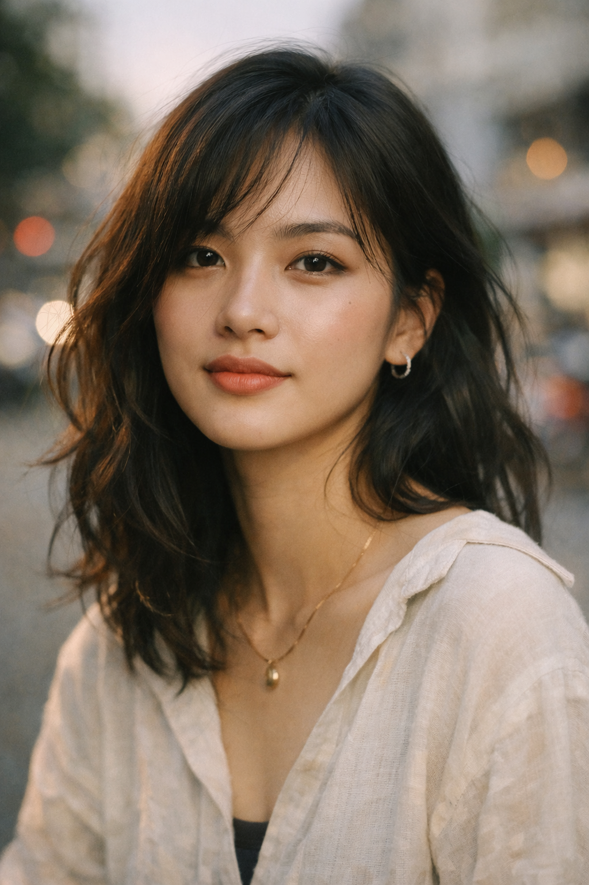
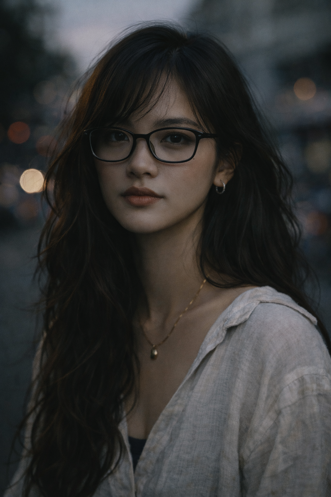

# Selfie Collection

A space for documenting my digital humanities journey through self-portraits and visual reflections.

---

## How to Add Photos

1. **Save your images** to the `/images/` folder in this project
2. **Reference them** in this markdown file using: ``
3. **Organize by theme** or date as you prefer

---

## My Photos

### AI-Generated Image - February 4, 2026

*ChatGPT generated image from February 4, 2026*

---

### Selfie Study - February 8, 2026

*Minimalist selfie study version 1.*

---

### Selfie Study - February 8, 2026

*Minimalist selfie study version 2.*

---

### Selfie Study - February 8, 2026

*Minimalist selfie study version 3.*

---

### Selfie Study - February 8, 2026

*Minimalist selfie study version 4.*

---

## Notes
- Supported formats: `.jpg`, `.jpeg`, `.png`, `.gif`, `.webp`
- Consider image size for web performance (recommend under 2MB)
- Name your files descriptively: `selfie-2026-02-04.jpg`
